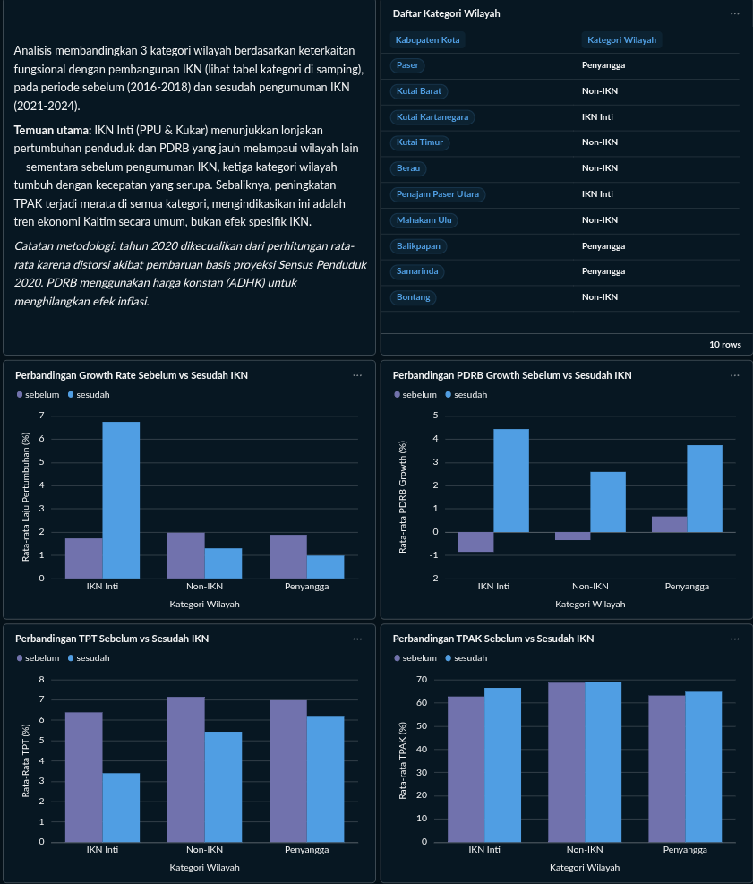
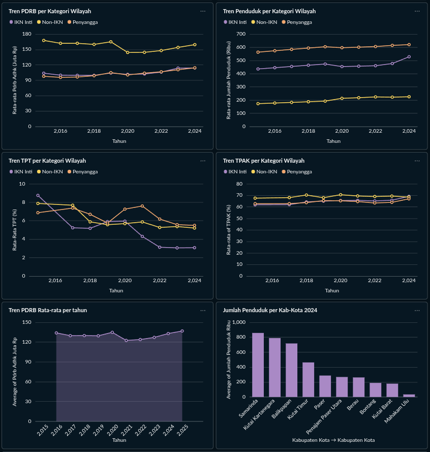
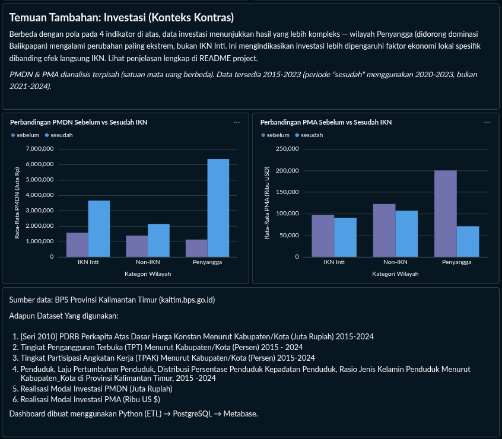

# Dampak IKN terhadap Ekonomi & Migrasi Penduduk Kalimantan Timur

Analisis Business Intelligence untuk menguji apakah pembangunan Ibu Kota Nusantara (IKN) berdampak nyata terhadap pertumbuhan ekonomi dan migrasi penduduk di wilayah sekitarnya, dibandingkan dengan wilayah lain di Kalimantan Timur.

> Dashboard dibangun dengan Metabase yang dijalankan secara lokal (Docker) — screenshot lengkap tersedia di bagian [Dashboard](#dashboard) di bawah. Lihat juga pembahasannya di **[LinkedIn]()**.

---

## Latar Belakang

Sejak IKN diumumkan pada 2019, muncul ekspektasi luas bahwa Kalimantan Timur — khususnya Penajam Paser Utara (PPU) dan Kutai Kartanegara (Kukar) sebagai lokasi kawasan inti — akan mengalami akselerasi pertumbuhan ekonomi dan menjadi tujuan migrasi baru. Project ini menguji hipotesis tersebut secara kuantitatif menggunakan data resmi BPS, membandingkan kondisi **sebelum** (2016–2018) dan **sesudah** (2021–2024) pengumuman IKN.

## Pertanyaan Riset

1. Apakah pertumbuhan penduduk di wilayah IKN Inti benar-benar lebih cepat dibanding wilayah lain?
2. Apakah pertumbuhan ekonomi (PDRB) mengikuti pola yang sama?
3. Apakah dampaknya konsisten di semua indikator, atau ada yang dipengaruhi tren umum (bukan spesifik IKN)?
4. Apakah realisasi investasi (PMDN & PMA) juga terkonsentrasi di wilayah IKN Inti?

## Kategorisasi Wilayah

Alih-alih membandingkan 10 kabupaten/kota satu-satu, wilayah dikelompokkan berdasarkan **keterkaitan fungsional** dengan IKN (bukan hanya kedekatan geografis):

| Kategori | Wilayah | Dasar Pertimbangan |
|---|---|---|
| **IKN Inti** | Penajam Paser Utara, Kutai Kartanegara | Lokasi fisik kawasan inti pembangunan IKN |
| **Penyangga** | Balikpapan, Samarinda, Paser | Balikpapan = akses logistik utama (bandara/pelabuhan); Samarinda = pusat pemerintahan provinsi; Paser = berbatasan langsung |
| **Non-IKN** | Kutai Barat, Kutai Timur, Berau, Bontang, Mahakam Ulu | Wilayah dengan keterkaitan fungsional lebih jauh dari aktivitas IKN |

## Sumber Data

Seluruh data bersumber dari **Badan Pusat Statistik Provinsi Kalimantan Timur** ([kaltim.bps.go.id](https://kaltim.bps.go.id)), periode 2015–2024:

| Indikator | Tabel BPS |
|---|---|
| PDRB Per Kapita (ADHB & ADHK) | Menurut Kabupaten/Kota |
| Tingkat Pengangguran Terbuka (TPT) | Menurut Kabupaten/Kota, Sakernas Agustus |
| Tingkat Partisipasi Angkatan Kerja (TPAK) | Menurut Kabupaten/Kota, Sakernas Agustus |
| Jumlah Penduduk & Laju Pertumbuhan | Menurut Kabupaten/Kota |
| Realisasi Investasi PMDN & PMA | Menurut Kabupaten/Kota (2015–2023) |

## Arsitektur & Tech Stack

```
BPS Kaltim (Excel)  →  Python (Pandas)  →  PostgreSQL (Docker)  →  Metabase
     Extract              Transform            Load                Visualize
```

- **ETL**: Python + Pandas + openpyxl — lihat [`etl_pipeline.py`](./etl_pipeline.py)
- **Database**: PostgreSQL 16 (star schema — `fact_regional_indicator` + `dim_kabupaten_kota`), dijalankan via Docker
- **Dashboard**: Metabase, dikoneksikan langsung ke PostgreSQL

## Metodologi

- **PDRB** menggunakan **Atas Dasar Harga Konstan (ADHK)**, bukan Harga Berlaku, untuk menghilangkan efek inflasi — sehingga kenaikan yang terlihat mencerminkan pertumbuhan volume ekonomi riil, bukan sekadar kenaikan harga.
- **Growth rate** (penduduk & PDRB) dihitung ulang secara manual dari angka absolut (`pct_change` per kabupaten/kota per tahun), bukan menggunakan kolom laju pertumbuhan bawaan BPS, karena basis perhitungan resminya berubah-ubah antar periode (lihat bagian Keterbatasan Data).
- **Tahun 2020 dikecualikan** dari perhitungan rata-rata growth rate karena terjadi lonjakan/penurunan tidak wajar di hampir semua kategori wilayah, konsisten dengan pembaruan basis proyeksi Sensus Penduduk 2020 (bukan perubahan riil).
- **Periode "sebelum"** dihitung dari rata-rata 2016–2018 (2015 dikecualikan karena tidak ada data pembanding tahun sebelumnya untuk menghitung growth rate).

## Dashboard

Dashboard interaktif dibangun dengan Metabase, terdiri dari: ringkasan kategori wilayah, 4 chart perbandingan sebelum-sesudah IKN (indikator utama), 4 line chart tren historis per kategori, dan section terpisah untuk temuan tambahan (investasi).





*Dashboard dijalankan secara lokal (Docker + Metabase) — lihat [Cara Menjalankan Ulang](#cara-menjalankan-ulang) untuk menjalankan sendiri.*

## Temuan Utama

Keempat indikator yang dianalisis menunjukkan pola yang konsisten: **IKN Inti mengalami perubahan paling signifikan** dibanding wilayah Penyangga maupun Non-IKN, pada periode sebelum (2016–2018) vs sesudah pengumuman IKN (2021–2024).

**1. Pertumbuhan penduduk melonjak drastis di IKN Inti**

| Kategori | Sebelum | Sesudah | Perubahan |
|---|---|---|---|
| IKN Inti | 1,73% | **6,74%** | +5,01 poin |
| Non-IKN | 1,97% | 1,30% | -0,67 poin |
| Penyangga | 1,88% | 0,99% | -0,89 poin |

Sebelum IKN diumumkan, ketiga kategori tumbuh dengan kecepatan serupa. Setelah IKN, IKN Inti melonjak ~4x lipat, sementara dua kategori lain justru sedikit melambat — mengindikasikan kemungkinan pergeseran konsentrasi penduduk ke wilayah IKN Inti. Mengingat IKN merupakan proyek strategis nasional, lonjakan ini kemungkinan besar bukan hanya berasal dari migrasi internal antar kabupaten/kota di Kaltim, tetapi juga migrasi dari luar daerah (provinsi lain) yang tertarik oleh proyek pembangunan berskala nasional ini. Data agregat pada analisis ini belum dapat memisahkan kedua sumber migrasi tersebut (lihat bagian Keterbatasan Data).

**2. Pertumbuhan ekonomi (PDRB) mengikuti pola serupa**

| Kategori | Sebelum | Sesudah | Perubahan |
|---|---|---|---|
| IKN Inti | -0,85% | **4,43%** | +5,28 poin |
| Non-IKN | -0,35% | 2,59% | +2,94 poin |
| Penyangga | 0,67% | 3,74% | +3,07 poin |

IKN Inti berubah paling drastis, dari pertumbuhan negatif menjadi yang tertinggi di antara ketiga kategori.

**3. Tingkat pengangguran (TPT) turun paling tajam di IKN Inti**

| Kategori | Sebelum | Sesudah | Perubahan |
|---|---|---|---|
| IKN Inti | 6,39% | **3,39%** | -3,00 poin |
| Non-IKN | 7,15% | 5,43% | -1,72 poin |
| Penyangga | 6,98% | 6,22% | -0,76 poin |

**4. Partisipasi angkatan kerja (TPAK) naik paling tinggi di IKN Inti**

| Kategori | Sebelum | Sesudah | Perubahan |
|---|---|---|---|
| IKN Inti | 62,72% | **66,44%** | +3,72 poin |
| Non-IKN | 68,66% | 69,10% | +0,44 poin (relatif flat) |
| Penyangga | 63,14% | 64,76% | +1,62 poin |

Kombinasi TPT turun tajam bersamaan TPAK naik tertinggi khusus di IKN Inti — sementara Non-IKN nyaris tidak berubah — memperkuat indikasi bahwa pembangunan IKN membuka lapangan kerja baru secara signifikan di wilayah tersebut, bukan sekadar tren ketenagakerjaan umum se-Kalimantan Timur.

*Catatan: TPT, TPAK, dan PDRB (level) dihitung dari rata-rata seluruh tahun pada masing-masing periode (2015–2018 untuk "sebelum"). Berbeda dengan growth rate (penduduk & PDRB) yang baseline "sebelum"-nya dihitung dari 2016–2018, karena tahun 2015 tidak memiliki tahun pembanding untuk menghitung persentase pertumbuhan.*

**5. Investasi (PMDN & PMA) menunjukkan pola yang berbeda — tidak sejalan dengan 4 indikator di atas**

| Indikator | Kategori | Sebelum | Sesudah | Perubahan |
|---|---|---|---|---|
| PMDN (Juta Rp) | IKN Inti | 1.563.502 | 3.653.828 | +133,7% |
| | Non-IKN | 1.372.208 | 2.123.833 | +54,8% |
| | Penyangga | 1.122.204 | 6.357.621 | **+466,6%** |
| PMA (Ribu USD) | IKN Inti | 97.555 | 90.734 | -7,0% |
| | Non-IKN | 122.676 | 107.206 | -12,6% |
| | Penyangga | 200.431 | 71.012 | **-64,6%** |

Berbeda dengan pola pada penduduk, PDRB, TPT, dan TPAK, wilayah **Penyangga** (bukan IKN Inti) mengalami perubahan paling ekstrem pada indikator investasi — didorong dominasi Balikpapan, yang sendirian menyumbang porsi besar dari total investasi kategori Penyangga (kategori ini hanya berisi 3 kabupaten/kota, sehingga rentan didominasi satu wilayah besar). Ini mengindikasikan realisasi investasi lebih dipengaruhi faktor ekonomi lokal spesifik (infrastruktur eksisting, kawasan industri, kondisi harga komoditas global) dibanding efek langsung pembangunan IKN — sebuah temuan kontras yang penting agar kesimpulan project ini tidak overclaim bahwa seluruh aktivitas ekonomi Kaltim bergeser ke IKN Inti.

*Catatan metodologi: PMDN dan PMA dianalisis terpisah (tidak digabung) karena satuan mata uang berbeda (Juta Rupiah vs Ribu US Dollar). Growth rate (%) tidak digunakan untuk investasi karena data realisasi investasi bersifat "lumpy" (dapat melonjak >100x dalam 1 tahun akibat satu proyek besar, atau bernilai 0 di tahun tanpa realisasi baru), sehingga persentase pertumbuhan menghasilkan angka ekstrem yang tidak representatif meski sudah dirata-ratakan dengan median. Sebagai gantinya, digunakan rata-rata nilai nominal per tahun. Data investasi hanya tersedia hingga 2023 (bukan 2024 seperti indikator lain), sehingga periode "sesudah" menggunakan 2020–2023 alih-alih 2021–2024.*

## Kesimpulan

Empat indikator inti — pertumbuhan penduduk, PDRB, TPT, dan TPAK — secara konsisten menunjukkan bahwa **IKN Inti (Penajam Paser Utara & Kutai Kartanegara) mengalami perubahan paling signifikan** dibanding wilayah Penyangga maupun Non-IKN sejak IKN diumumkan. Sebelum 2019, ketiga kategori wilayah bergerak dengan pola yang relatif serupa; setelah 2019, IKN Inti melonjak jauh di depan pada hampir semua indikator sosial-ekonomi ini.

Namun, data **investasi (PMDN & PMA) tidak menunjukkan pola yang sama** — justru wilayah Penyangga (didominasi Balikpapan) yang mengalami perubahan paling ekstrem. Ini penting: bukan berarti IKN "tidak berdampak" pada investasi, tapi menunjukkan bahwa **realisasi investasi dipengaruhi faktor yang lebih kompleks** (infrastruktur eksisting, kondisi ekonomi global, kebijakan sektoral) dibanding migrasi penduduk atau aktivitas ekonomi harian yang lebih langsung terhubung dengan keberadaan penduduk baru di suatu wilayah.

Kesimpulannya: data mendukung hipotesis bahwa **IKN mendorong migrasi dan pertumbuhan ekonomi lokal di kawasan intinya**, tetapi dampaknya **tidak seragam di semua dimensi ekonomi** — sebuah nuansa yang penting untuk analisis kebijakan maupun studi lanjutan ke depannya.

## Keterbatasan & Catatan Data Quality

Ditemukan dan ditangani selama proses ETL:

- **Data 2020 tidak reliable** untuk perhitungan growth rate akibat pembaruan basis Sensus Penduduk 2020 (SP2020) — dikecualikan dari rata-rata.
- **TPT breakdown per kabupaten/kota tidak dipublikasikan BPS untuk 2016** (hanya tersedia di level provinsi) — data kosong dibiarkan sebagai *missing value*, bukan diisi paksa.
- **Kesalahan input di sumber**: jumlah penduduk Samarinda 2021 tercatat 83,1 ribu (seharusnya ~831 ribu, kemungkinan kehilangan satu digit saat input) — diperbaiki dengan interpolasi linear dari 2020 & 2022. Dikonfirmasi sebagai kesalahan input BPS melalui penelusuran sumber eksternal.
- **Realisasi PMDN Balikpapan 2015 tercatat sangat rendah** (Rp 1,5 miliar) dibanding tahun-tahun sekitarnya (2016: Rp 255 miliar) — divalidasi melalui sumber eksternal dan dikonfirmasi akurat, kemungkinan mencerminkan dampak anjloknya harga komoditas global 2014–2016 terhadap iklim investasi Kaltim. Angka tidak diubah karena terbukti bukan anomali pencatatan.
- **Urutan kolom TPT/TPAK berbeda antar file** BPS (file 2015–2018 vs 2019–2024) — sempat menyebabkan kolom TPT dan TPAK tertukar di iterasi awal analisis (memunculkan kesimpulan keliru bahwa TPAK naik merata di semua kategori). Ditemukan lewat validasi silang dengan angka mentah, dan diperbaiki dengan mendeteksi indikator berdasarkan teks judul tabel, bukan asumsi posisi kolom.
- Data agregat tingkat kabupaten/kota **tidak dapat memastikan mekanisme migrasi** (migrasi antar-daerah vs tren demografi nasional vs faktor ekonomi lokal lain) — diperlukan data migrasi *origin-destination* untuk konfirmasi lebih lanjut.
- Data realisasi investasi per kabupaten/kota **awalnya tidak ditemukan** di sumber terbuka yang umum dicoba (Satu Data Kaltim, DPMPTSP, Sipintar) — akhirnya ditemukan di BPS Kaltim pada kategori **"Keuangan Pemerintah, Fiskal dan Statistik Sektor Publik"**, kategori yang tidak intuitif untuk dicari pertama kali.

## Cara Menjalankan Ulang

```bash
# 1. Jalankan database
docker compose up -d
docker exec -i ikn_kaltim_db psql -U ikn_user -d ikn_kaltim < schema.sql

# 2. Jalankan ETL (baca data mentah di data/raw/, hasil ke data/processed/)
python3 -m venv venv && source venv/bin/activate
pip install -r requirements.txt
python3 etl_pipeline.py

# 3. Load ke database
docker run --rm --network project-ikn-kaltim_default -v "$(pwd)":/app -w /app python:3.10-slim \
  bash -c "pip install pandas sqlalchemy psycopg2-binary --quiet && python load_to_postgres_docker.py"

# 4. Buka Metabase di localhost:3000, hubungkan ke database ikn_kaltim
```

## Struktur Project

```
project-ikn-kaltim/
├── data/
│   ├── raw/              # Data mentah dari BPS (tidak diedit langsung)
│   └── processed/        # Hasil ETL, siap di-load ke database
├── etl_pipeline.py        # Script Extract-Transform-Load
├── schema.sql              # Skema star schema PostgreSQL
├── docker-compose.yml      # Definisi service Postgres + Metabase
└── load_to_postgres_docker.py
```

---

*Dibuat oleh Rayhan Raya Farabi sebagai bagian dari portofolio Business Intelligence. Data bersumber dari BPS Provinsi Kalimantan Timur.*